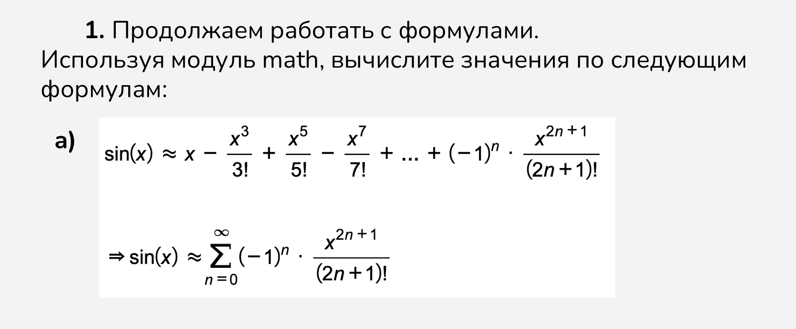
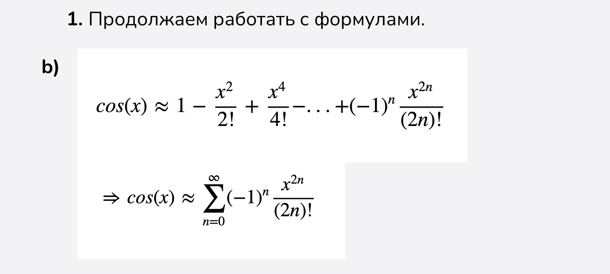
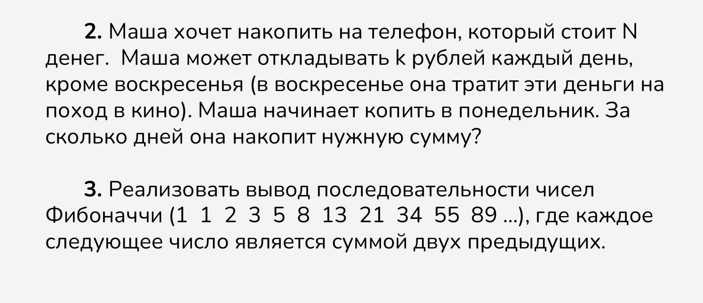
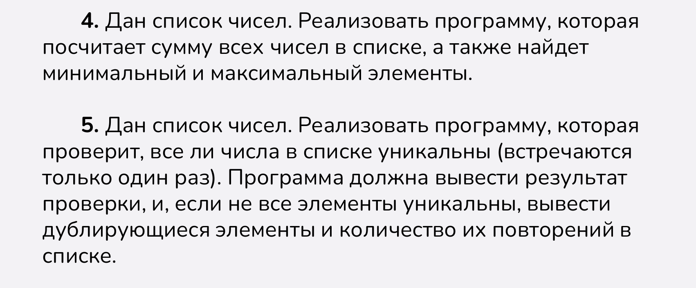

# Основы Python (Часть 3) 🐍
Добро пожаловать в репозиторий с решениями заданий по теме **"Основы Python"**.

---

## 📁 Структура репозитория
- `scripts/` — содержит Python-скрипты с решениями.
- `images/` — папка с изображениями заданий.
- `README.md` — этот файл с описанием.

---

## 📜 Задания

**Скриншоты:**  

---

**Решение:**  
[Скрипт](scripts)

---
